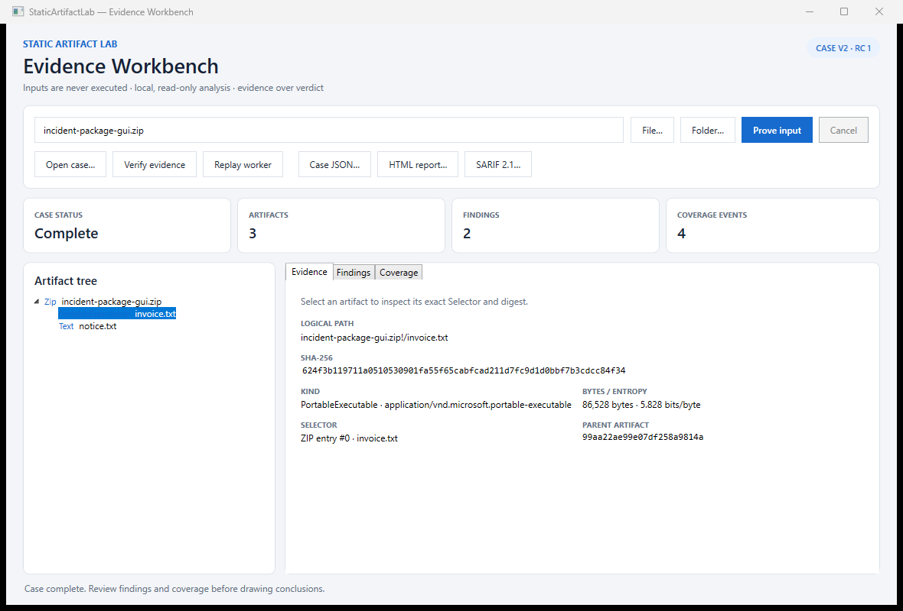

# StaticArtifactLab

StaticArtifactLab records what is inside an unfamiliar file set before anyone
decides what those files mean. It walks regular files and ZIP-based containers
offline, binds every accepted child to its parent and selector, and writes a
case that another machine can inspect or replay.

It is useful for package triage, incident hand-offs, build artifact review, and
any workflow where “we scanned it” is less helpful than a list of exact bytes,
limits, and skipped work.



## What it does

- identifies PE, ELF, Mach-O, ZIP, 7z, RAR, gzip, PDF, PNG, OLE, scripts, and
  text from bytes rather than trusting the file name;
- opens ZIP, JAR, NuGet, APK, and OOXML packages recursively without extracting
  children to disk;
- records SHA-256, length, entropy, media type, parent, depth, and an exact
  root or ZIP-entry selector for every accepted artifact;
- reports extension mismatches, nested executables, unsafe archive paths,
  excessive expansion, duplicate content, high-entropy opaque data, and bytes
  trailing a PNG IEND chunk;
- makes rejected and skipped work visible as coverage records;
- verifies a saved case against available root and nested source bytes;
- replays the fixed worker and lists added, removed, or changed evidence;
- exports case-v2 JSON, standalone HTML, and SARIF 2.1.

Findings are observations. A quiet report does not make a file safe.

## Quick start

The Windows release contains `StaticArtifactLab.exe` and
`static-artifact.exe`. The GUI is the easiest way to explore a case. The CLI is
better for repeatable jobs and CI.

```powershell
static-artifact.exe prove .\incoming\package.zip `
  --case .\evidence\package.sal-case.json `
  --html .\evidence\package.html `
  --sarif .\evidence\package.sarif
```

Check that the selectors and all still-available source bytes agree with the
case:

```powershell
static-artifact.exe verify .\evidence\package.sal-case.json
```

Run the same limits again and compare artifact evidence:

```powershell
static-artifact.exe replay .\evidence\package.sal-case.json `
  --out .\evidence\package.replayed.json
```

Build from source with the .NET 8 SDK:

```powershell
dotnet restore StaticArtifactLab.slnx
dotnet build StaticArtifactLab.slnx -c Release --no-restore
dotnet test StaticArtifactLab.Tests/StaticArtifactLab.Tests.csproj -c Release --no-build
```

## Evidence model

A root selector records its ordinal, logical name, and source path. A nested
selector records its ZIP entry index and name plus the parent SHA-256. The
child record adds its own SHA-256 and length. Its 24-character artifact ID is
derived from the canonical parent/selector/content tuple.

This lets `verify` reopen the root, locate the same archive entry, and hash the
recovered bytes. It can distinguish three states:

- valid and verified: source bytes are available and match;
- valid but unavailable: the case is structurally sound, but source bytes are
  no longer present;
- invalid: an ID, relationship, selector, length, or digest does not agree.

The full contract is in [docs/case-format.md](docs/case-format.md).

## Analysis bounds

StaticArtifactLab refuses unbounded container work. Every limit used for a run
is stored in the case.

| Limit | Default |
| --- | ---: |
| Root file | 100 MiB |
| Expanded child | 100 MiB |
| Total expanded bytes | 512 MiB |
| Accepted artifacts | 5,000 |
| Filesystem nodes considered | 20,000 |
| Entries considered per ZIP | 1,000 |
| Container depth | 8 |
| Expansion ratio | 200:1 |
| Findings | 2,000 |

CLI overrides are available through `--max-root-mib`, `--max-artifact-mib`,
`--max-total-mib`, `--max-artifacts`, `--max-fs-nodes`, `--max-entries`, `--max-depth`, and
`--max-ratio`. A reached limit changes the case status to `partial`; it does
not silently shorten the result.

## Commands and exit codes

| Command | Result |
| --- | --- |
| `prove <input>` | Builds a new case from one file or a directory. |
| `verify <case>` | Validates structure and hashes every available selector. |
| `replay <case>` | Re-runs the recorded input and compares evidence paths. |

| Code | Meaning |
| ---: | --- |
| 0 | Command completed; case/verification/replay is complete. |
| 1 | Usage, input, or output error. |
| 2 | The case has partial coverage. |
| 3 | Case evidence is invalid. |
| 4 | Replay differs from the recorded case. |

Findings alone do not change the exit code. That keeps policy decisions outside
the evidence collector.

## Project layout

| Project | Role |
| --- | --- |
| `StaticArtifactLab.Core` | Bounded traversal, recognition, rules, reports, verification, and replay. |
| `StaticArtifactLab.Cli` | Scriptable `prove`, `verify`, and `replay` commands. |
| `StaticArtifactLab.Gui` | Windows evidence workbench over the same core API. |
| `StaticArtifactLab.Tests` | Boundary, adversarial archive, report safety, CLI, and GUI contract tests. |

## Security and privacy

Inputs are opened read-only and are never executed, loaded as assemblies, or
sent over the network. Archive children stay in bounded memory. Filesystem
symbolic links and reparse points are not followed.

Case files deliberately contain source paths, names, hashes, and observations.
Treat them as investigation material before sharing. HTML uses a restrictive
Content Security Policy and encodes names and messages, but it may still expose
the evidence you asked the tool to record.

See [SECURITY.md](SECURITY.md) for invariants, supported versions, and private
reporting guidance.

## Limits

- Version 1 recursively parses ZIP-compatible containers only. Other container
  formats are recognized and recorded as unsupported coverage.
- Format recognition is intentionally small and explainable; it is not a full
  file-format validator.
- Static evidence cannot prove origin, intent, runtime behavior, or safety.
- Replay compares artifact paths, selectors, and digests. It is not a forensic
  chain-of-custody system or a digital signature service.
- Root source paths make replay convenient but reduce portability and may be
  sensitive.

## Contributing and license

Changes are welcome when they preserve bounded, deterministic, read-only
analysis. Start with [CONTRIBUTING.md](CONTRIBUTING.md). StaticArtifactLab is
released under the [MIT License](LICENSE).
